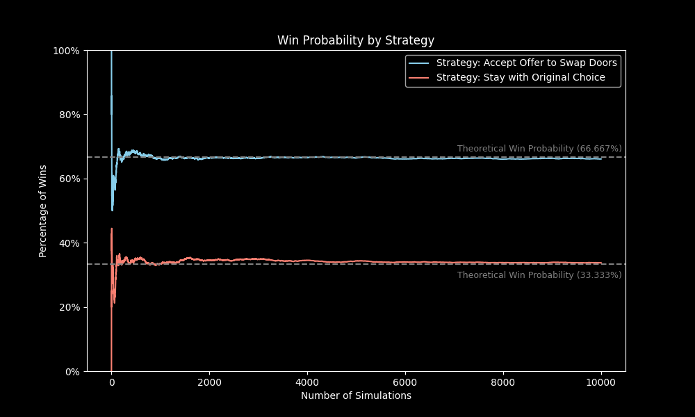

# Introduction

The Monty Hall Problem is a famous probability puzzle named after Monty Hall, the original host of the game show "Let's Make a Deal". The problem can be described as follows:

**1.** You are a contestant on a game show, and you are presented with three doors 🚪🚪🚪.

**2.** Behind one of the doors is a prize (like a car 🚗), and behind the other two are "zonks" (like donkeys 🫏).

**3.** You choose one of the doors, let's say Door 1.

**4.** The host, who knows where the prize is, then opens another door, let's say Door 3, which reveals a zonk (a donkey).

**5.** Now, you are given a choice: stick with your original choice (Door 1), or switch to the remaining unopened door (Door 2).

**Now, the question is: what should you do to maximize your chances of winning the prize??** 💰

# Solution

The correct answer is that you should **accept the offer and switch doors...**

- 🔥 Making the switch gives you a **66.667%** chance of winning
- 👎 Sticking with your original choice leaves you with a **33.333%** chance

Although it might seem counterintuitive at first, the reason behind this solution is that when you switch, you benefit from the information provided by the host's action of opening a door with a zonk.

Essentially, switching allows you to "double" your chances of winning 📈

# Explanations

### 1. Simple Explanation

Below are all possible arrangements of having one prize and two donkeys behind three doors, and the result of staying or switching after initially picking Door #1 in each case:

<div align='center'>

|  Door #1  |  Door #2  |  Door #3  | Result from Staying | Result from Switching |
| :-------: | :-------: | :-------: | :-----------------: | :-------------------: |
|  Donkey   |  Donkey   | **Prize** |     Win Donkey      |     **Win Prize**     |
|  Donkey   | **Prize** |  Donkey   |     Win Donkey      |     **Win Prize**     |
| **Prize** |  Donkey   |  Donkey   |    **Win Prize**    |      Win Donkey       |

</div>

A player who sticks with their original choice wins in just one of three equally probable scenarios, while a player who switches wins in two out of three cases.

If the contestant initially picks a donkey (2 of 3 doors), the contestant **_will_** win the prize by switching because the other donkey can no longer be picked, as the host had to reveal its location. However, if the contestant initially chooses the prize (1 of 3 doors), they **_will not_** win by switching.

So, by using the strategy to always make the switch, winning or losing **only** depends on whether the contestant has initially chosen a donkey ($\frac{2}{3}$ probability) or the prize ($\frac{1}{3}$ probability).

The fact that the host subsequently reveals a donkey behind one of the unchosen doors changes nothing about the initial probability.

### 2. Bayes' Theorem and Conditional Probability

**Conditional Probability** is a measure of the probability that an event occurs, given that another event has also occurred. This can be calculated using the formula:

<div align='center'>

$\huge{P(A \mid B) = \frac{P(A \cap B)}{P(B)}}$

</div>

where:

- $P(A \mid B)$ is the probability of event $A$ occurring given that event $B$ has occurred.
- $P(A \cap B)$ is the probability of both $A$ and $B$ occurring.
- $P(B)$ is the probability of event $B$ occurring.
- $P(B)$ is assumed to **not** be zero, as division by zero is undefined.

**Bayes' Theorem** is a mathematical formula used to determine the conditional probability of events. From the definition of conditional probability, Bayes' Theorem can be derived for events as given below:

<div align='center'>

$\large{P(A \mid B) = \frac{P(A \cap B)}{P(B)}}$, where $\large{P(B) \ne 0}$

$\large{P(B \mid A) = \frac{P(B \cap A)}{P(A)}}$, where $\large{P(A) \ne 0}$

Then, by equating $P(A \cap B)$ and $P(B \cap A)$ from both equations and rearranging:

$\large{P(A \cap B) = P(A \mid B) * P(B) = P(B \mid A) * P(A)}$

<p style='font-size: 1.75em'>&darr;</p>

$\huge{P(A \mid B) = \frac{P(B \mid A) * P(A)}{P(B)}}$

</div>

where:

- $P(A \mid B)$ is the probability of event $A$ occurring given that event $B$ has occurred.
- $P(B \mid A)$ is the probability of event $B$ occurring given that event $A$ has occurred.
- $P(A)$ is the probability of event $A$ occurring.
- $P(B)$ is the probability of event $B$ occurring.
- $P(B)$ is assumed to **not** be zero, as division by zero is undefined.

#### Solving the Monty Hall Problem:

- Assume the contestant picks Door #1 and the host subsequently reveals a donkey behind Door #2
- Let event $A$ be that the prize is behind Door #1
- Let event $B$ be that the host reveals a donkey using Door #2

Finding $P(A)$ is simple ... there is a $\frac{1}{3}$ chance that the prize is behind Door #1

There are two doors left, each having a $\frac{1}{2}$ chance of being chosen the reveal a donkey - giving us $P(B \mid A)$

Now, finding $P(B)$ can be tricky, so first consider that:

1. The contestant has chosen Door #1
2. If the prize is behind Door #1, the host will not choose it. So, there are two doors left and they will open Door #2 to reveal a donkey $\frac{1}{2}$ of the time.
3. If the prize is behind Door #2, the host will always open Door #3, as it is their only option.
4. If the prize is behind Door #3, the host will reveal a donkey behind Door #2 100% of the time.

Taking these instances into account, $P(B)$ can be illustrated as:

<div align='center'>

$\large{P(B) = (\frac{1}{3} * \frac{1}{2}) + (\frac{1}{3} * 0) + (\frac{1}{3} * 1) = \frac{1}{6} + \frac{1}{3} = \frac{1}{2}}$

</div>

Therefore,

<div align='center'>

$\Large{P(A \mid B) = \frac{\frac{1}{2} * \frac{1}{3}}{\frac{1}{2}} = \frac{1}{3}}$

<p style='font-size: 1.75em'>&darr;</p>

$\Large{P(notA \mid B) = 1 - P(A \mid B) = 1 - \frac{1}{3} = \frac{2}{3}}$

</div>

**Given that there is a donkey behind Door #2, the probability of the prize being behind Door #1 is $\frac{1}{3}$. So, with there being 0 probability of the prize being behind Door #2, the probability of winning by switching to Door #3 is $\frac{2}{3}$.**

**Showing that it is, in fact, in the contestant's favor to accept the host's offer to switch doors.**

### 3. Computer Simulations

#### Simulation Strategy: Accept the Offer to Switch Doors

```python
# Import libraries
import pandas as pd
import numpy as np

# Number of iterations to simulate
num_iterations = 10000

# Create a list to store the results
results = []

# Simulation loop
num_wins = 0
for iteration in range(1, num_iterations + 1):
    # Randomly choose a door for the prize
    prize_door = np.random.randint(1, 4)

    # Contestant's initial choice
    initial_choice = np.random.randint(1, 4)

    # Donkey door revealed by the host
    donkey_door = next(door for door in [1, 2, 3] if door != prize_door and door != initial_choice)

    # Contestant's final door after switching
    final_door = next(door for door in [1, 2, 3] if door != initial_choice and door != donkey_door)

    # Determine if the contestant wins by switching doors
    # Note: Stored as dtype: Boolean
    win = final_door == prize_door

    # Increment the number of wins if the contestant wins
    if win:
        num_wins += 1

    # Calculate the proportion of wins
    proportion_of_wins = num_wins / iteration

    # Store the result in the list
    results.append({
        "iteration": iteration,
        "win": win,
        "proportion_of_wins": proportion_of_wins
    })

# Convert the list of results to a DataFrame
df = pd.DataFrame(results)

# Write dataframe to CSV file
df.to_csv(r"[file path]\csv_files\swap_strategy_data.csv", index=False)

```

#### Simulation Strategy: Stick with Original Choice

```python
# Import libraries
import pandas as pd
import numpy as np

# Number of iterations to simulate
num_iterations = 10000

# Create a list to store the results
results = []

# Simulation loop
num_wins = 0
for iteration in range(1, num_iterations + 1):
    # Randomly choose a door for the prize
    prize_door = np.random.randint(1, 4)

    # Contestant's initial choice
    initial_choice = np.random.randint(1, 4)

    # Determine if the contestant wins by sticking with their initial choice
    # Note: Stored as dtype: Boolean
    win = initial_choice == prize_door

    # Increment the number of wins if the contestant wins
    if win:
        num_wins += 1

    # Calculate the proportion of wins
    proportion_of_wins = num_wins / iteration

    # Store the result in the list
    results.append({
        "iteration": iteration,
        "win": win,
        "proportion_of_wins": proportion_of_wins
    })

# Convert the list of results to a DataFrame
df = pd.DataFrame(results)

# Write dataframe to CSV file
df.to_csv(r"[file path]\csv_files\stay_strategy_data.csv", index=False)

```

#### Visualizing the Data

```python
# Import libraries
import pandas as pd
import matplotlib.pyplot as plt
import matplotlib.ticker as ticker  # Import ticker module

# Read CSV files into DataFrames
swap_strategy_df = pd.read_csv(
    r"[file path]\csv_files\swap_strategy_data.csv"
)
stay_strategy_df = pd.read_csv(
    r"[file path]\csv_files\stay_strategy_data.csv"
)

# Extract iteration and win percentage values from swap strategy data
swap_iterations = swap_strategy_df["iteration"]
swap_win_percentages = round(swap_strategy_df["proportion_of_wins"] * 100, 3)

# Extract iteration and win percentage values from stay strategy data
stay_iterations = stay_strategy_df["iteration"]
stay_win_percentages = round(stay_strategy_df["proportion_of_wins"] * 100, 3)

# Create plot
plt.style.use("dark_background")  # Set plot style to dark mode
plt.figure(figsize=(10, 6))
plt.ylim(0, 100)  # Set y-axis range

# Plot data
plt.plot(
    swap_iterations,
    swap_win_percentages,
    color="skyblue",
    label="Strategy: Accept Offer to Swap Doors",
)

plt.plot(
    stay_iterations,
    stay_win_percentages,
    color="salmon",
    label="Strategy: Stay with Original Choice",
)

# Add horizontal lines representing the theoretical win probabilities
plt.axhline(y=66.667, color="gray", linestyle="--")
plt.axhline(y=33.333, color="gray", linestyle="--")

# Add text labels for plot lines
plt.text(
    x=8750,  # x-position
    y=68.5,  # y-position
    s="Theoretical Win Probability (66.667%)",  # Text to display
    color="gray",
    ha="center",
    fontsize=9,
)

plt.text(
    x=8750,  # x-position
    y=29,  # y-position
    s="Theoretical Win Probability (33.333%)",  # Text to display
    color="gray",
    ha="center",
    fontsize=9,
)

# Add plot titles and labels
plt.title("Win Probability by Strategy")
plt.xlabel("Number of Simulations")
plt.ylabel("Percentage of Wins")
plt.legend(fontsize=10)

# Set a formatter to include '%' in y-axis ticks
percent_formatter = ticker.FuncFormatter(lambda x, _: f"{x:.0f}%")
plt.gca().yaxis.set_major_formatter(percent_formatter)

# Show the plot
plt.show()

# Note: Saved as "...\assets\win_probability_by_strategy.png"
```


_Line graph visualizing the win probability for each strategy from data collected by simulated events_

#### Breakdown of the Results:

Making the Switch:

1. **Overall Success Rate:**
   - Win Proportion by the End of the Simulation: **66.090%**
   - Theoretical Expected Value: **66.667%**
   - This suggests that the simulation is modeling the Monty Hall Problem accurately
2. **Fluctuation:**
   - The proportion of wins fluctuates throughout the simulation
   - In the initial stages, you can see more significant changes due to a smaller sample size
   - However, as the number of simulations increases, it converges closer to the theoretical expected value
   - Typical behavior observed where the effect of statistical variability diminishes with a larger number of trials
3. **Convergance to Theoretical Expectation:**
   - As more trials are run, the results converge toward the theoretical expectation of a $\frac{2}{3}$ chance of winning
   - This is a key point of the Monty Hall Problem: intuitively, many people assume that there's a 50/50 chance of winning, but the switching strategy has a higher probability of success

Sticking with the Original Choice:

1. **Overall Success Rate:**
   - Win Proportion by the End of the Simulation: **33.750%**
   - Theoretical Expected Value: **33.333%**
2. **Comparison with Switching Strategy:**
   - According to the theoretical and experimental probabilities found, staying with the original door chosen simply yields a lower success rate
   - Essentially, switching allows you to "double" your chances of winning

# Conclusion

This exploration of the Monty Hall Problem utilized multiple approaches to demonstrate the statistical advantage of accepting the host's offer, making the switch, and going home with that prize.

### Key Takeaways

- The optimal strategy in a "Let's Make a Deal" scenario is to **always switch** after the host reveals a non-winning door
- The combination of theoretical and empirical methods confirms the $\frac{2}{3}$ success rate for switching and $\frac{1}{3}$ for staying
- Understanding the Monty Hall Problem requires a certain grasp of conditional probability and the impact of new information on decision-making
